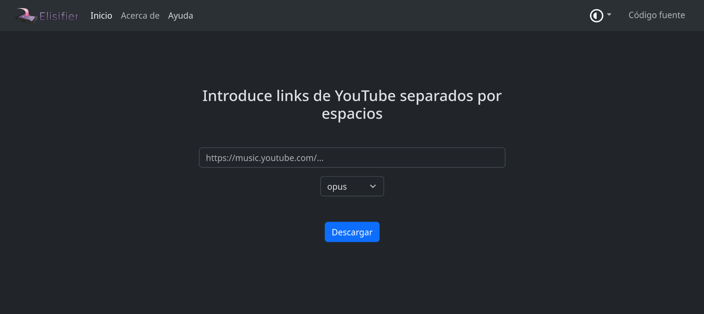
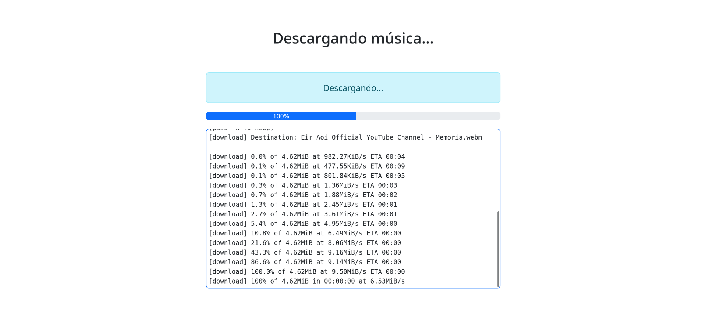
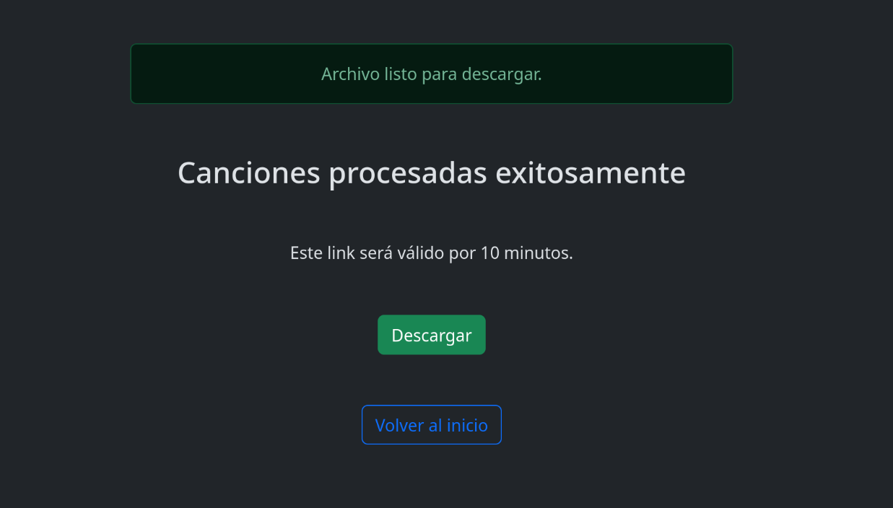

# Elisifier

[](https://codeberg.org/Autumn64/Elisifier/pulls)
[](https://codeberg.org/Autumn64/Elisifier/issues)
[](https://codeberg.org/Autumn64/Elisifier)
[](https://codeberg.org/Autumn64/Elisifier/src/branch/main/LICENSE)


## Un descargador de música libre y online





### Descripción
Elisifier es un _software_ en línea hecho con [Flask](https://palletsprojects.com/projects/flask/) y [yt-dlp](https://github.com/yt-dlp/yt-dlp), que permite descargar música y _playlists_ desde YT de forma rápida y sencilla.

### Características
- Hecho con Flask y yt-dlp.
- Descarga tanto canciones como playlists y las comprime en un archivo zip.
- Descarga en la calidad máxima disponible.
- Permite seleccionar entre los formatos de audio más populares.
- Agrega los metadatos de cada canción (nombre, artista, álbum, etc.), así como los AlbumArt.
- Es autohosteable y descentralizado.
- Por el momento sólo permite links de YT, ya que no se cuenta con una tecnología accesible para descargar música de otros servicios de _streaming_ populares.

### Cómo hostear
La mayoría de dependencias para Elisifier ya vienen en el archivo `requirements.txt`. Sin embargo, algunos componentes necesitan instalarse por separado, los cuales son los siguientes:

```
ffmpeg (para la conversión y codificación de audio)
ImageMagick (para el procesado de AlbumArts)
Kid3-cli (para la modificación de metadatos)
```
Puede instalar estos componentes desde el gestor de paquetes de su distribución. También puede optar por instalar `yt-dlp` de manera global en su sistema.

Adicionalmente, Elisifier utiliza `deno`, siguiendo las [recomendaciones de yt-dlp](https://github.com/yt-dlp/yt-dlp/issues/15012). Puede descargar e instalar `deno` con el comando proporcionado en su [página oficial](https://deno.com/).

#### Frontend

El frontend de Elisifier puede hostearse desde un servidor Apache o Nginx tradicional, o desde algún servicio como GitHub Pages o Cloudflare Pages, ya que consiste en código HTML y JavaScript que no requiere renderizado del lado del servidor.

No olvide editar la URL del socket en el archivo `src/js/index.js`, que debería apuntar hacia el backend.

#### Backend

**Los comandos mostrados a continuación, así como el script proporcionado, aplican para GNU/Linux. Adáptelos dependiendo de su sistema operativo.**

- Clone este repositorio
```sh
git clone https://codeberg.org/Autumn64/Elisifier.git
```
- Cree un entorno virtual de Python
```sh
python3 -m venv .
```
- Modifique el archivo `src/backend/settings.json`, y adáptelo a sus propias necesidades.
```json
{
    "host": "IP",
    "port": 5000,
    "cors": "www.sitioweb.com",
    "accepted": [
        "youtube.com",
        "youtu.be", 
        "invidious",
        "inv.",
        "yewtu.be"
    ],
    "block_foreign_urls": true
}
```
- Cree la carpeta `/src/download`, ya que sin ella Flask no podrá manejar los archivos correctamente.

- Ejecute el archivo `run.sh`
```sh
./run.sh
```
El script se encargará de habilitar el entorno virtual, de descargar las dependencias del archivo `requirements.txt`, y de ejecutar Elisifier. El _backend_ del servicio se expondrá por el puerto designado en el archivo de configuración.

### Directrices de contribuciones

Si desea contribuir, por favor haga un fork de este repositorio, y cree una [pull request](https://codeberg.org/Autumn64/Elisifier/pulls) con sus propuestas. Tiene permitido modificar y/o redistribuir todo el código de este repo, siempre y cuando lo haga acatando los términos estipulados en la [Licencia Pública General Affero de GNU versión 3](./COPYING) o cualquier versión superior.

### Información extra
La naturaleza de este proyecto lo vuelve muy vulnerable a ataques y a la censura por parte de Google o de cualquier otra empresa. Por esta razón, Elisifier se desarrolló con el propósito de ser descentralizado y fácilmente autohosteable. Elisifier no está afiliado a yt-dlp, ni a Invidious, ni a ningún proyecto relacionado con YT.

Muchísimas gracias a todas y todos nuestros [contribuyentes](https://codeberg.org/Autumn64/Elisifier/activity/yearly).

#### Todo el código en este repositorio está bajo la [Licencia Pública General Affero de GNU v3 o superior](./LICENSE), con algunas librerías y módulos pudiendo poseer distintas licencias permisivas compatibles con la licencia principal del proyecto. Este programa está destinado a su distribución para propósitos no comerciales, no promueve (aunque tampoco condena) la piratería, y ni la propietaria del proyecto ni sus colaboradores son responsables del uso que cualquiera fuera de éste pueda dar al software proporcionado y a sus insumos.

#### All the code in this repository is licensed under the [GNU Affero General Public License version 3 or later](./LICENSE), with some libraries and modules that may be under different permissive licenses compatible with the main project's license. This program is meant to be distributed for non-commercial purposes, doesn't promote (but neither does it condemn) piracy, and neither this project's owner nor its contributors are responsible for the use anyone outside of it may give to the software provided and its assets.